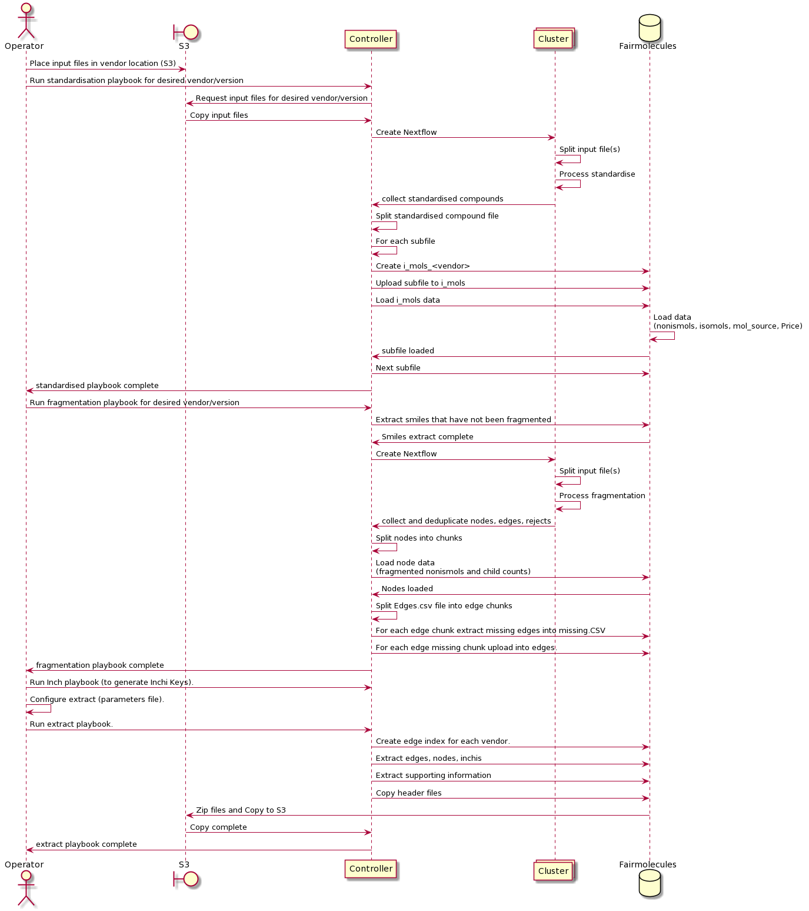
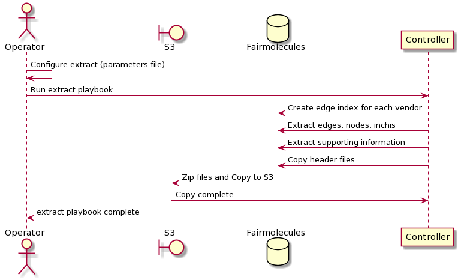
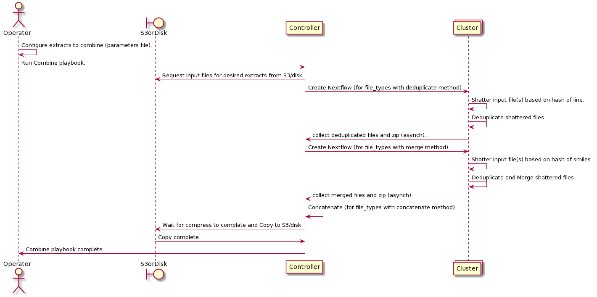
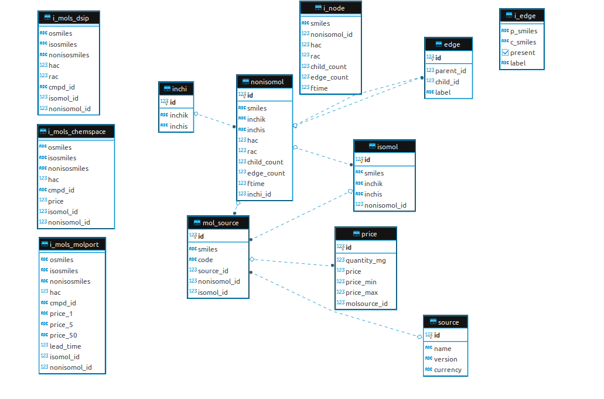
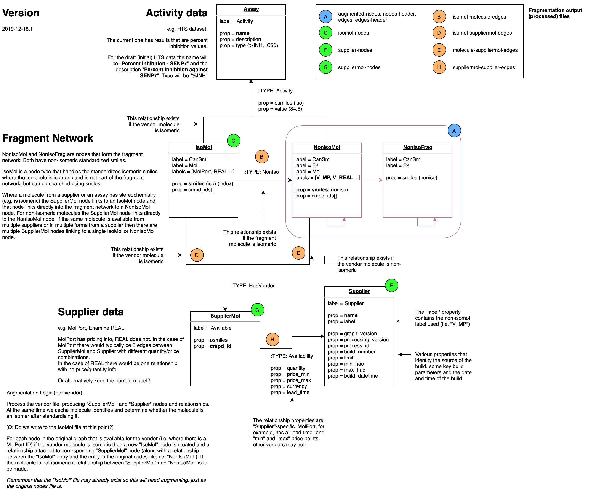

# Fragmentation Optimisation


Optimisation of fragmentation process through the use of a postgres database
to previously already fragmented data. This will allow delta changes to an
existing database rather than having to completely re-fragment the input files - 
speeding up the loading of extracts to the Neo4j database used by
fragment search. 

>   For kubernetes execution of the fragmentation process refer to our
    [fragmentor-ansible] repository, which contains a playbook that
    launches the fragmentor processes as Pods within a suitably configured
    Kubernetes cluster.

Summary of Contents:

-   Ansible playbooks to populate the database: standardisation, fragmentation
    and inchi creation. 
-   A playbook to extract datasets of single and combinations of vendors from
    the database for import into the Fragnet Search Neo4j database.
-   A playbook to combine different extracted datasets
    (from, say, different databases) to create new Fragnet search Neo4j databases.
-   Playbooks are also provided to create, start, stop, and backup the database. 

The libraries currently supported are as follows:
- Xchem: dsip, probing library, spotfinder
- Molport
- Chemspace: bb
- Enamine: ro5
- sdf (generic)

Further datasets are planned.

**Notes**

-   Standardise and fragmentation code based on the Fragalysis Repository 
-   Nextflow scripts are used to control a cluster for Standardisation,
    Fragmentation, Inchi calculation and combine plays.
-   The scripts contain parameter controlled chunking of input files at various
    stages to control and optimise throughput to the sql
    database. This can be tuned to the hardware/cluster.   
-   Processing normally starts and ends with an AWS S3 repository -
    assumed to contain the smiles data from vendors to be imported 
    into the process and will be the destination for Neo4j compatible
    extract files - and where they can be picked up by Fragnet Search.  

## Building the images
The images are built by the Travis CI/CD process. Review the `.travis.yml`
file for details. A convenient docker-compose can be used to build
the images for local experimentation.

## Playbook preparation
For the production configuration, it is assumed that the user has access to
a cluster and that the following instructions would be run on the head node.  

It is always worth running the playbooks from within your own Python
environment, to avoid disturbing the system Python: -

    $ python3 -m venv ~/.venv/fragmentor
    $ source ~/.venv/fragmentor/bin/activate
    $ pip install --upgrade pip

And, depending on your distribution, you might need SELinux bindings...

    $ sudo yum install libselinux-python3

Install requirements: -

    $ pip install -r requirements.txt
    $ ansible-galaxy install -r requirements.yaml
    
Some ansible playbook postgres tasks require the postgres client (psql)
to be installed on the head machine. Details can be found at
https://www.postgresql.org/download/linux/redhat/

You will also need credentials for S3, so you will need to set up the
following parameters. Regardless of whether you're _actually_ using an AWS
bucket or not, we use the standard AWS variables: -

    $ export AWS_ACCESS_KEY=<Access Key ID>
    $ export AWS_SECRET_KEY=<Secret Access Key>
    $ export AWS_REGION=eu-central-1

>   If you're using an alternative provider's S3 store, just put the
    relevant details into the appropriate AWS variable.
    `AWS_REGION` can be blank (`''`)', and for some providers it needs to be.

If you are using a non-AWS S3 bucket you will need to provide the S3
endpoint, but leaving this environment variable undefined if you are using
AWS: -

    $ export S3_URL=<Non-AWS S3 Sevrvide Endpoint/URL>

Now navigate to the ansible Project's ansible directory: -

    $ cd ansible

Test connection to the hosts using `ping`. You will need to ensure that the
user's `~/.ssh/id_rsa` is set correctly (or use [ssh-agent]) so that Ansible
can ssh to the servers.

If the following works you should be able to run the project playbooks: -

    $ ansible -m ping all

## Creating the database server (OpenStack)

### Openstack
If using the **OpenStack** cloud provider you will have to provide suitable
production and backup servers - our playbooks do not create these
physicals. The OpenStack deployment is experimental and assumes IP addresses
(130.246.214.46 and 130.246.214.154).

>   If you want to deploy to OpenStack consult with us on server preparation. 

### AWS EC2
If you're using AWS a production server can be instantiated automatically.
You will need AWS credentials to allow general EC2 configuration and a set of
parameters to define the server flavour: -

You will need an AWS VPC and subnet.
 
```yaml
---
db_server_state: present
aws_db_instance_type: t3a.2xlarge
db_volume_size_g: 10
database_cloud_provider: aws
db_shared_buffers_g: 4
db_max_parallel_workers: 8
aws_vpc_subnet_id: <CLUSTER_PUBLIC_SUBNET_ID>
aws_vpc_id: <CLUSTER_VPC_ID>
```

Now create the server: -

    $ ansible-playbook site-db-server.yaml -e @parameters 

Adjust your parameters so that they include the address of the database server.
You'll need this with other plays. The server's IP address is printed by the
above play: -

    TASK [db-server : Display DB server address (Private IP)] *****************
    Thursday 22 October 2020  18:54:00 +0000 (0:00:00.048)       0:00:24.557 ** 
    ok: [localhost] => {
        "server_result.instances[0].private_ip": "10.0.0.192"
    }

In this case you'd add the following to the parameter file: -

```yaml
database_login_host: 10.0.0.192
```

Using the AWS console wait for the database server instance to become ready
(initialise) before trying to create the database.

## Creating the Postgres Database
The database is created in a docker container. Configuring the production
database server (a destructive action) is done via an ansible playbook.
This playbook also pre-loads the `vendor_name` table in the database with 
the vendor file types currently supported by the process. 

    $ ansible-playbook site-db-server-configure.yaml  \ 
        -e deployment=<development|production> \
        -e database_cloud_provider=<aws|openstack>

>   You only really need to run the `site-db-server-configure` play once.
    It configures the server with Docker and runs the designated database
    image and then formats the initial DB.

The `deployment` parameter, one of `development` or `production`
the playbook to either set up a production instance or a separate development
instance.

>   Note that if there are automatic update jobs running that periodically
    stop servers (to install new software  for example), it may be prudent to
    disable them and use alternative arrangements to prevent the database being 
    brought down when in use.

Note that `site-db-server-configure` is primarily aimed at a production
database instance. For development (local) a postgres container could be
launched with a command something like:         

    $ docker run --shm-size=1g --name psql \
        -v /home/user/project/postgresql/data:/var/lib/postgresql/data 
        -e POSTGRES_PASSWORD=1234 \
        -p 5432:5432 \
        -d postgres:alpine \
        -c 'logging_collector=true' 

In this case, an `extract` subdirectory directory must also be created within
the `data` directory for the extract play to successfully run. This must
have correct permissions so that ansible can write to it. 

Example: navigate to the ansible directory

    $ ansible-playbook site-db-server-configure_create-database.yaml \
        -e deployment=development

## Configuring the S3 Directory Structure
For a production deployment, the ansible playbook `site-standardise` is
configured to import vendor data files from a tree structure defined as either:

    <raw><vendor><library><version>

or

    <raw><vendor><version>

**Examples**

-   Data files for version `v1` of the `dsip` library for vendor `xchem`
    should be placed in directory `xchem/dsip/v1` 

-   Data files for version `2020-10` for vendor `Molport` (only one library)
    should be placed in directory `molport/2020-10` 

The ansible playbook `site-extract` is configured to export datasets to a
tree structure defined as:

For Neo4j extracts for individual vendor libraries: -

    <extract><vendor_library><version>

For Neo4j extracts for combinations of vendor libraries: -  

    <combination><first vendor_library><date>

**Examples**

-   The Neo4j extract for version `v1` of the `dsip` library for vendor
    `xchem` is exported to directory: `xchem_dsip/v1` 
-   The Neo4j extract for version `2020-10` for vendor `Molport`
    (only one library) is exported to directory `molport/2020-10` 
-   The Neo4j extract for a combination of the above libraries run on 1/1/2020
    (assuming xchem is listed first in the request) is exported to directory
    `combination/xchem_dsip/2020-01-01`

## Fragmentation Process Description
The sequence diagram below shows the basic steps in the fragmentation process
including a fragmentation database called FairMolecules. The advantage of the
database approach is that each time a new dataset of molecules is provided by 
the vendor, the relatively lightweight standardisation step must still be
performed - but only new molecules will have to go through the hardware
intensive fragmentation step.  

-   The process is run by an operator. The operator configures the process and
    place the input files in the correct location on AWS S3. 
-   The Controller is the head node where the fragmentor repository is installed.
    All Ansible playbooks are run from the head node.
-   The Cluster is a Cluster-group used by nextflow for the standardisation,
    fragmentation and inchi key generation steps. Ansible handles these machines.
-   FairMolecules is the postgres database containing standardisation and
    fragmentation data as well as indexes used by the extraction playbook.
    Extracted Neo4j datasets are uploaded from here back to S3 to complete the
    process. 
-   Once a new library has been added to the database, processing to extract
    and combine datasets are done via the extract and combine plays.
    See below for more details.      



## Process a Vendor Library
The process consists of three steps, described below:

### Standardisation
It's easier to run playbooks using a YAML-based parameter file,
where all the control variables can be set. A typical parameter file
(`parameters.yaml`) might look like this: -

```yaml
---
database_login_host: 130.246.214.154
deployment: production
runpath: /data/fragmentor/run-01
clean_start: yes
vendor: xchem_dsip
version: v1
extracts:
- lib:
    vendor: xchem_dsip
    version: v1
    regenerate_index: yes
hardware:
  production:
    parallel_jobs: 20
    postgres_jobs: 400
```

There is a template file with all the above settings and more explanation
at: ansible/roles/run-parameters.template that you can copy.

Armed with a parameter file, like the one shown above,
the standardisation step is run as follows: -

    $ ansible-playbook site-standardise.yaml \
        -e @parameters.yaml

### Fragmentation
Armed with a parameter file,
the fragmentation step is run as follows: -

    $ ansible-playbook site-fragment.yaml \
        -e @parameters.yaml

A fragmentation step would normally be processed directly after a
standardisation step, but as this step is driven by the database it is
possible to run multiple standardisation steps for a vendor/library followed
by a single fragmentation step.

> Optional parameter add_backup: default: no

If set to yes, this automatically backs up the database after the
fragmentation play. 

### Create Inchi Keys
The Create Inchi step will identify any molecules that have not had inchi keys
generated yet and process them. It is not vendor/library specific and can be
run as follows:

    $ ansible-playbook site-inchi.yaml \
        -e @parameters.yaml

As this step is driven by the database it possible to run multiple
standardisation/fragmentation steps for different 
vendor/libraries followed by a single create inchi step.

> Optional parameter add_backup: default: yes

If set to yes, this automatically backs up the database after the Inchi play.
Note that this defaults to "yes" as at 
this stage the data import for a new library would be complete.

## Extract a Neo4j Dataset to S3.



The Extract Neo4j Dataset playbook will create a dataset exportable to Neo4j
containing either a single vendor or combination of vendors from information
contained in the database. The export is based on parameters provided in a 
parameter file containing vendor(s) and version(s) in the following example
format:

```yaml
---
database_login_host: 130.246.214.154
deployment: production
runpath: /data/fragmentor/run-01
clean_start: yes
hardware:
  production:
    parallel_jobs: 20

extracts:
- lib:
    vendor: enamine_ro5
    version: jun2018
    regenerate_index: no
- lib:
    vendor: molport
    version: 2020-02
    regenerate_index: yes
```

The first time a library version is extracted, `regenerate_index` should be
set to `yes` so that the index of edges for the latest library version can be
regenerated. For subsequent runs (e.g. to extract combinations) it should be set to
`no` for speed - for the larger vendors this can be a significant amount of time. 
A template (`extract-parameters.template`) is provided for this file.

The command is:

    $ ansible-playbook site-extract.yaml \
        -e @parameters.yaml 

ote that for the larger extracts to complete there needs to be sufficient
temporary space on the postgres pgdata directory for the database queries to
complete. In the case of the complete extract including enamine and molport,
for example, around 900GB if temporary space is required.

## Combining Neo4 Datasets from S3/local disk.



This playbook can be used to combine existing Neo4j datasets to produce one
new Neo4j dataset. For example, if datasets were produced using more than one
database, this playbook can combine them allowing a combination of
public/proprietary data. Datasets can be downloaded from up to two AWS S3
repositories or directly from disk. The export can either be to disk or saved
up to AWS S3. The combination is based on parameters provided in a parameter
file containing extracts(s) and version(s) in the following example format,
which writes results to the local filesystem (`disk`) rather than the
default (`s3`):

```yaml
---
database_login_host: 130.246.214.154
deployment: production
runpath: /data/fragmentor/run-01
hardware:
  production:
    postgres_jobs: 400

combine:
- lib:
    path: xchem_dsip
    data_source: disk
- lib:
    path: extract/xchem_spot/v1
    data_source: s3
    bucket: "{{ bucket_in_1 }}"
    aws_access_key: "{{ aws_access_key_in_1 }}"
    aws_secret_key: "{{ aws_secret_key_in_1 }}"
- lib:
    path: extract/xchem_probe/v1
    data_source: s3
    bucket: "{{ bucket_in_2 }}"
    aws_access_key: "{{ aws_access_key_in_2 }}"
    aws_secret_key: "{{ aws_secret_key_in_2 }}"

# The path_out parameter defines the subdirectory that will be used
# for the output in "combinations" .
path_out: xchem_combi_20200715

data_source_out: disk
```

There is a template file with all the above settings and more explanation
at: ansible/roles/combine-parameters.template that you can copy.

**Notes**

The AWS access keys are provided as external parameters to the script in a
similar way to the other playbooks. In the repository configuration,
they are all set to `AWS_ACCESS_KEY_ID` and `AWS_SECRET_KEY_ID`, but this mapping
can be changed in the file `roles/combine/defaults/main.yaml`.
A template (`combination-parameters.template`) is provided.

For data source S3, the path if the full path to the dataset in the bucket
rather than the vendor. This allows existing combinations to also be used as
input sources.

For data source disk - files are expected (by default) to be in a directory
called `extract` (configurable) in the `runpath`. If `data_source_out` is set
to `disk`, then the combined extract will be available in the `combine`
directory on the `runpath`. 

The command is:

    $ ansible-playbook site-combine.yaml \
        -e @parameters.yaml

## Backing up and Restoring the Database
The backup playbook can also be used in isolation from the other playbooks.
It uses `pg_dumpall` to create a zipped copy of the complete database.
The play will automatically clear up all versions of backups - the number
of backups retained defaults to 2, but can be adjusted per database
(the backup_count parameter in group_vars/all.yaml). 

Example: 

    $ ansible-playbook site-backup.yaml \
        -e deployment=production 

A backed up database can be restored with the restore playbook.
It defaults to the latest saved backup. Other backups can be chosen by setting
the optional restore_file parameter to the name of the file in the `hourly`
folder.

Examples: 

    $ ansible-playbook site-restore.yaml \
        -e deployment=production
    
    $ ansible-playbook site-restore.yaml \
        -e deployment=production \
        -e restore_file=backup-2020-07-23T16:12:56Z-dumpall.sql.gz

Similarly there are playbooks to stop and start the database server.
The postgres startup configuration items are set 
up in the start-database playbook.

    $ ansible-playbook site-db-server-configure_stop-database.yaml \
        -e deployment=production
     
    $ ansible-playbook site-db-server-configure_start-database.yaml \
        -e deployment=production   

As an alternative to the pg_dump based backup and restore plays a simple
backup play has also been created to copy the database volume to the backup
volume in the DB server. It stops the database, copies the files and then
restarts the database: -

Example: navigate to the ansible directory

    $ ansible-playbook site-backup-copy.yaml \
        -e deployment=production 

## Tuning Parameters
The file all.yaml contains the following parameters used to control the
different steps of the process.  

>   Hardware sizing - used to calculate size of chunks in standardization/fragmentation.
    A map of variables based on deployment and should reflect the approximate
    CPUs available on the machine/cluster and how many postgres parallel 
    jobs that can be safely run. The second parameter is currently only used
    in building the index in the site-extract play.

For example:

```yaml
hardware:
  development:
    # Parallel_jobs is used in calculating chunk sizes for processing -
    # the normal assumption is that twice as many jobs are created as cores
    # are used. If this is less than cluster_cores, then not all the cluster
    # will be used. It is usually safe to set the parallel_jobs and
    # cluster_cores to the same value.
    parallel_jobs: 8
    # Cluster cores is used in the nextflow_config.
    # It defines the size of the cluster to use.
    cluster_cores: 8
    # Sort memory defines the minimum memory required for deduplication/sorting.
    sort_memory: 8 MB
    # Number of connections to postgres - note that this should be less
    # than max_worker_processes in start-database.yaml.
    postgres_jobs: 6
  production:
    # 100 parallel jobs/cores should be sufficient to process all but the
    # largest libraries (full enamine/molport load).
    # For role combine, ideally this might be increased when combining
    # large databases - otherwise there might be a timeout
    parallel_jobs: 100
    cluster_cores: 100
    sort_memory: 8GB
    postgres_jobs: 18
```

> Vendor defaults.

A map of defaults based on the vendor and library. In general it should not
be necessary to change these unless there is a significant change to the
size/composition of vendor supplied libraries.

For example xchem_dsip is set up as follows.

```yaml
vendors:
  xchem_dsip:
    # Used for sizing timeouts and processing parameters
    approx_vendor_molecules: 800
    # Total time (in minutes) across all CPUs -
    # Used for sizing timeouts and processing parameters
    est_total_fragmentation_time: 10
    # Minimum heavy atom count for extraction/fragmentation processing
    fragminhac: 0
    # Maximum heavy atom count for extraction/fragmentation processing
    fraghac: 36
    # Maximum frag cycles for fragmentation processing
    fragmaxfrags: 12
    # Limit for partial fragmentation processing (not operational)
    fraglimit: 0
    # Extract Playbook: Chunk of molecules to be processed before insert to index
    # This is a sensitive value - settings for each vendor should be tuned.
    # So the values below are set based on the number of edges per mol_source value
    # and validated by testing.
    indexchunksize: 100
    # Total time (in minutes) to build index (will be divided by number of postgres_jobs)
    index_build_time: 10
```

>   The `indexchunksize` is is used in the build_index playbook to balance
    deduplication vs record insertion and indicates how many source molecules are
    processed in memory before a database commit. The most efficient value appears
    to depend on how "clean" molecules are. For Molport and Enamine a value
    around 300 has been found to be efficient, whereas for 
    Chemspace it was possible to increase it to 2000.      

If you are required to request server-side encryption for S3 bucket `put`
operations you can set the variable `bucket_requires_ecryption: yes` (or
`bucket_out_requires_encryption: yes` during the combination play).

## Database Sizing 
Numbers are given below were achieved using the maximum fragmentation cycles
parameter set to 12. 

| Vendor/Lib       | Version     | Molecules   | Nodes       |Edges        |
| ---------------- | ----------- | ----------- | ----------- | ----------- | 
| Xchem_dsip       | v1          | 768         | 5099        | 14421       |
| Molport          | 2020-02     | 7118865     | 104407052   | 582264651   |
| Chemspace_bb     | December2019| 17257752    | 27265866    | 111716670   |
| Enamine_ro5      | Jun2018     | 39765321    | 178240230   | 1130306251  |
| Xchem_spot       | v1          | 96          | 576         | 1388        |
| Xchem_probe      | v1          | 239         | 857         | 2396        |
| Full Combination | 20200623    | ---         | 307499949   | 1754938701  |

Note that the full combination de-duplicates nodes and edges found in more
than one library.

The combined datasets resulted in a postgres database size of approximately
1.5TB. Disk space must, however, allow for future increases and for temporary
workspace for queries so a minimum of 3TB is recommended for the main and
backup directories.

## FairMolecules Database Schema

The diagram below shows the FairMolecules database schema: 



Tables beginning with “i_” (not shown) are used in the loading process and
tables beginning with "o_" are used in the extract process. 

## Fragnet Model Neo4j Database Schema



## Adding a new Vendor Library to the Repository

The following steps summarize the changes required to add a new vendor
library to the fragmentor ansible process:  

### Repository Changes

-   The new vendor/library details must be added to the vendor name table
    in the database. The load script in the site-configure role
    (configure/files/p10_load_config_data.sql) should be updated to reflect this.
    
    For example:

```sql
insert into vendor_name (vendor_name, currency, supplier_node_name, supplier_node_label) values ('xchem_spot', NULL, 'Xchem','V_XSPOT');
```
 
-   Folder changes must be made to add the new library in the data directory
    of the repository (subsequently matched on S3 directory) matching the
    structure given above. Note that the input file should be compressed with
    gzip and, if using an existing format, the columns/header line must match
    the existing format. For example:

```
  xchem/spot/v1/spotfinder.smi.gz
```
 
-   Group-vars. The overall configuration in ansible/group-vars/all.yaml
    requires a configuration for each vendor/library. For example:

```
  xchem_spot:
    approx_vendor_molecules: 100
    est_total_fragmentation_time: 10
    fragminhac: 0
    fraghac: 36
    fragmaxfrags: 12
    fraglimit: 0
    indexchunksize: 100
    index_build_time: 10
```

-   Add a new vendor/library specific configuration file to the standardise
    role to identify the input file format, python script, upload table and
    copy columns that will be used for standardisation. Note that the name
    should begin with the vendor/library identifier. For example
    standardise/vars/xchem_spot-variables.yaml contains:

```yaml
# The ansible unpack tasks - can be vendor specific
unpacker: decompress-gz-all
# Python script used to standardise the molecules
standardiser: frag.standardise.scripts.dsip.standardise_xchem_compounds
# Input file template (unzipped) expected by standardiser.
# If there are multiple files this can be a glob. 
standinputfile: spotfinder.smi
# Upload table template to match fields in standardised compounds. 
standardise_copy_table: i_mols_dsip
# Fields to upload to table (used in copy statement). 
standardise_copy_columns: osmiles,isosmiles,nonisosmiles,hac,cmpd_id
```
 
-   Add a new vendor/library specific yaml task file to unpack the raw data
    if special processing is required (see chemspace for an example). If this
    is an existing format then the standard unpacker is referred to (as above).
-   If the new vendor input file is the same as a current format, then an
    existing standardisation python script can be used. If the layout varies
    then more customisation is required. Please see below for more details on this.
-   Add a new create script for creating the i_mols_table 
    (ansible/standardise/files/vendor/f40_create_stand_database.sql) and a newload script 
    (ansible/standardise/files/vendor/f40_load_standardised_data.sql) to upload
    this data into the database. If a new python script has been written,
    then please see the customisation section below. Otherwise, if this is an
    existing format then the script for that format can be copied. For example,
    spot matches dsip:

```sql
-- Create Fragmentation Database SQL Statements for Libary xchem_spot
-- Purpose: Creates fragmentation company specific tables. This is the same as the xchem_dsip library.
DROP TABLE IF EXISTS i_mols_dsip;

-- Create i_mols        
CREATE TABLE i_mols_dsip (
  osmiles TEXT,
  isosmiles TEXT,
  nonisosmiles TEXT,
  hac SMALLINT,
  cmpd_id TEXT,
  isomol_id INTEGER,
  nonisomol_id INTEGER
);
```
- The site-fragment playbook should not require any specific changes apart from the fragmentation configuration 
 parameters in all.yaml.
- The site-inchi playbook should not require any specific changes
- The site-extract playbook should not require any specific changes.
- The site-combine playbook should not require any specific changes.

### Implementation Changes

-   It is recommended to backup the "production" database using the site-backup play.
-   Update the "production" database to add the new vendor_name records.
-   Upload the input files to AWS S3 in the correct file location so they can be
    found by the fragmentor playbooks (see above).
-   Pull the updated repository from the head node.

### Further Customisation 

Some vendors (for example Molport and Chemspace) contain additional information
in the input file, usually in the form of pricing information. Pricing
information can be provided in different formats, so a flexible database layout 
has been provided. However, additional steps are required:

-   A specific standardisation module will need to be written to be able to
    read the additional columns. The standardisation python scripts are located
    in frag/standardise/scripts/(vendor). They are all written in similar 
    formats with the same input parameters as these are used in the ansible playbook. 
-   Any additional columns added are passed through to new table separated
    fields in the staging file standardised-compounds.tab.
-   Note also, that adding a new python module requires the git repo to be
    tagged so that the nextflow processes can find the repository and download
    it to the cluster. The nextflow_container_tag parameter in ansible/group_vars/all.yaml 
    has to be updated with this tag.
-   A dedicated i_mols_(vendor) table will have to be created in
    f40_create_stand_database.sql to allow for the new columns in
    standardised-compounds.tab. Similarly, the columns will have to be added
    to the parameters and the f40_load_standardised_data.sql adapted.
    If the new fields do contain pricing information, then an sql insert statement 
    will have to be coded to add this data to the price table.
    The f40_load_standardised_data.sql scripts for chemspace 
    and Molport are two examples of how this might be accomplished.  

## Using an existing Vendor Library with new parameters
If an existing Vendor Library supports your fragmentation needs you can
provide (over-ride) the built-in parameters by supplying your own.
You will need to: -

-   **Site your data** appropriately
-   **Provide parameters** that over-ride the built-in values
    for your source file-type
-   Verify that the database is sufficiently configured to deal with
    your fragmentation needs

The following example illustrates how you might utilise SDF fragment
processing for an SDF file of your choice.

### Site your data
Place SDF files are located in your AWS bucket using the
path `raw/vendor/sdf/<version>/<standinputfile>.gz`

>   The version can be any string i.e. v1. It's just a string (with no '_')

### Provide parameters
When running playbooks to process you data, for example standardising
your custom SDF file you may need to over-ride the built-in
defaults for the file type being processed. You may have an especially small
file or an especially large one. If so you may want to adjust parameters
that determine the number of sub-processes that will run and timeouts that will
be used.

>   The built-in `group_vars/all.yaml` has documentation for the
    parameters in its `vendors/xchem_dsip` variable.

You will need to provide a `vendors` map and some additional variables.

A set of parameters for SDF might be defined like this: -

```yaml
---
vendors:
  sdf:
    approx_vendor_molecules: 50
    est_total_fragmentation_time: 10
    fragminhac: 0
    fraghac: 36
    fragmaxfrags: 12
    fraglimit: 0
    indexchunksize: 100
    index_build_time: 10
# Input file template (unzipped) expected by standardiser.
# It can be a name of a file or, if there are multiple files, it can be a glob.
standinputfile: test.sdf
# Compound Prefix used in creating the compound-id's.
# For the other vendors this is hardcoded as the company name.
standard_compound_id_prefix: SDF
# Field in SDF file to be used for compound id.
standard_compound_id_field: mr_id
```

## Running Python Scripts directly via a Conda Environment

Create the environment:

    $ conda env create -f environment.yml

Activate the environment:

    $ conda activate fragmentor

Removing the environment:

    $ conda env remove --name fragmentor

---

[ssh-agent]: https://www.ssh.com/ssh/agent
[fragmentor-ansible]: https://github.com/InformaticsMatters/fragmentor-ansible.git
[galaxy-patch]: https://github.com/InformaticsMatters/galaxy-patch
