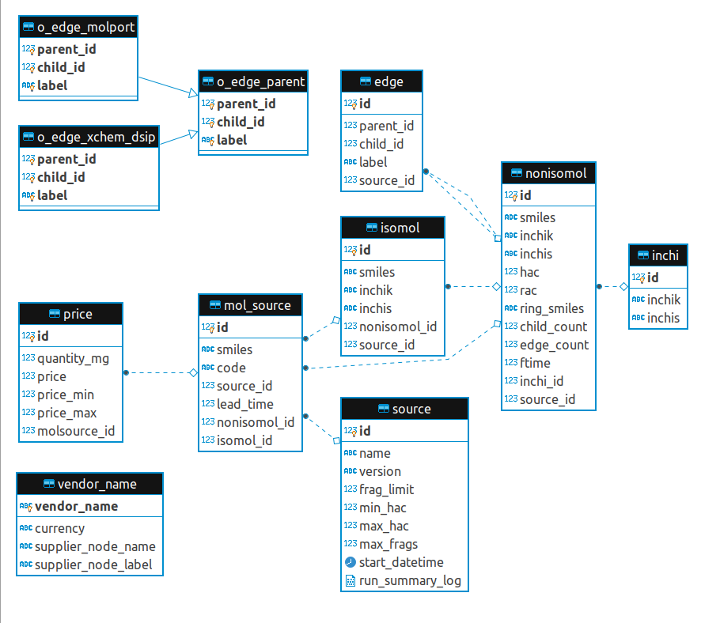

# Fragmentation Optimisation

[](https://travis-ci.com/InformaticsMatters/fragmentor)


Optimisation of fragmentation process through the use of a postgres database to store already fragmented data. This 
will allow delta changes to an existing database rather than having to completely re-fragment the input files - 
speeding up the loading of extracts to the Neo4j database.

Summary of Contents:

- Ansible playbooks to: create postgres database, standardisation, fragmentation and inchi creation to populate the database 
- A further playbook to extract datasets of single and combinations of vendors for import into the Fragnet Search Neo4j database.
- Standardise and fragmentation code based on the Fragalysis Repository 
- Nextflow scripts to control cluster for Standardisation and Fragmentation steps.
- Automatic parameter controlled chunking of input files at various stages to control throughput to the sql database.  
- Processing is automated but can be adjusted with control parameters.
- Processing starts/ends with an AWS S3 repository - assumed to contain the smiles data from vendors to be imported 
into the process and will be the destination for Neo4j compatible extract files - and where they can be picked up by 
Fragnet Search.  

The libraries currently supported are as follows:
- Xchem: dsip, probing library, spotfinder
- Molport
- Chemspace: bb
- Enamine: ro5

## Prerequisites

For the production configuration, it is assumed that the user has access to a cluster and that the following 
instructions would be run on the head node.  

Install requirements: -

    $ pip install -r ../requirements.txt
    $ ansible-galaxy install -r ../requirements.yaml
    
You will need to provide an `OS_USERNAME` (expected by host_vars)
in order to connect to the DB server configuration. You will also need to
ensure that the user's `~/.ssh/id_rsa` is set correctly so that Ansible can ssh
to the servers. If the following works you should be able to run the
project playbooks.

    $ ansible -m ping all

Some ansible playbook postgres tasks require the postgres client (psql) to be installed on the head machine.
Details can be found here: https://www.postgresql.org/download/linux/redhat/

You will also need AWS credentials for S3 to set up the following parameters. 

```
export AWS_ACCESS_KEY_ID=<Access Key ID>
export AWS_SECRET_ACCESS_KEY=<Secret Access Key>
```

## Creating the Postgres Database

The database is created in a docker container. Configuring the production database server (a destructive action) is 
done via an ansible playbook. This playbook also pre-loads the `vendor_name` table in the Fairmolecules database with 
the vendor files types currently supported by the process. 

```
$ ansible-playbook site-configure.yaml  \ 
          -e deployment=<development|production>
```

Example: navigate to the ansible directory

    $ ansible-playbook site-configure.yaml -e deployment=production

>   You only really need to run the `site-configure` play once.
    It configures the server with Docker and runs the designated database
    image and then formats the initial DB.

Parameter deployment=development|production

This parameter tells the playbook to either set up a production instance (a database server) or to use a Postgres in 
a local docker container on, say, a laptop. The deployment is configured in the all.yaml file.

>   Note that if there are automatic update jobs running that periodically stops servers (to install new software 
    for example),  it may be prudent to disable them and use alternative arrangements to prevent the database being 
    brought down when in use.


Note that site-configure is primarily aimed at a production database instance. for a local (development) postgres a  
docker container could be launched with a command something like:         

```
$ docker run --shm-size=1g --name psql -v /home/user/project/postgresql/data:/var/lib/postgresql/data 
  -e POSTGRES_PASSWORD=1234 -p 5432:5432 -d postgres:alpine -c 'logging_collector=true' 
```

Example: navigate to the ansible directory

    $ ansible-playbook site-configure_create-database.yaml -e deployment=development


## Process Description

The sequence diagram below shows the basic steps in the new end-to-end fragmentation 
process including a fragmentation database called FairMolecules. The advantage of the database 
approach over the current process is that each time a new dataset of molecules is provided by 
the vendor, the relatively lightweight standardisation step must still be performed - but only 
new molecules will  have to go through the fragmentation step. As this is hardware intensive, 
large time/cost savings should be possible. 

- The process is run by an operator. The operator configures the process and place the input 
files in the correct location on AWS S3. 
- The Controller is the head node where the fragmentor repository is installed. All Ansible 
playbooks are run from the head node.
- The Cluster is a Cluster-group used by nextflow for the standardisation, fragmentation and 
inchi key generation steps. Ansible handles these machines.
- Fairmolecules is the postgres database containing standardisation and fragmentation data as
 well as indexes used by the extraction playbook. Extracted Neo4j datasets are uploaded from 
 here back to S3 to complete the process.   


## Configuring the AWS S3 Directory Structure

For a production deployemnt, the ansible playbook site-standardise is configured to import vendor data files from a tree 
structure defined as either:

    <raw><vendor><library><version>
or

    <raw><vendor><version>

Examples: 
- Data files for version: v1 of the dsip library for vendor xchem should be placed in directory:
```
 xchem/dsip/v1 
```
- Data files for version: 2020-02 for vendor Molport (only one library) should be placed in directory:
```
 molport/2020-02 
```

The ansible playbook site-extract is configured to export datasets to a tree structure defined as:

    <extract><vendor_library><version> for Neo4j extracts for individual vendor libraries
or 

    <combination><first vendor_library><date> for Neo4j extracts for combinations of vendor libraries 

Examples: 
- The Neo4j extract for version: v1 of the dsip library for vendor xchem is exported to directory:
```
xchem_dsip/v1 
```
- The Neo4j extract for version: 2020-02 for vendor Molport (only one library) is exported to directory:
```
molport/2020-02 
```
- The Neo4j extract for a combination of the above libraries run on 1/1/2020 (assuming xchem is listed first in the 
request) is exported to directory:
```
combination/xchem_dsip/2020-01-01 
```


## Process a Vendor Library

The process consists of three steps, described below:

### Standardisation

The standardisation step is run as follows:

```
$ ansible-playbook site-standardise.yaml  \ 
          -e vendor=<vendor_library> \ 
          -e version=<version> \
          -e deployment=<development|production> \
          -e runpath=<work directory for this run> \
          (-e add_file=<yes|no> \)
          (-e clean_start=<yes|no>)
```

Example: navigate to the ansible directory

```
$ ansible-playbook site-standardise.yaml -e vendor=xchem_dsip -e version=v1 -e deployment=production -e runpath=/data/share-2/run01 
```

> Parameter deployment=development|production

This parameter tells the playbook to use either:
 1. AWS S3 or the data directory in the repository (which contains small test files) as a source for input files.
 2. The production or development postgres database.

> Optional parameter add_file: default: no

The standardisation step will validate whether the library has been processed before and raise an error if this is the 
case. The optional add_file parameter allows an additonal (set of) files to be added to an existing library. Note that 
the standardisation step will process all files in the input location, so the add_file will work more efficiently if this
location only contains the required files for that run.  

> Optional parameter clean_start: default: yes

If set to 'No', it will not delete the contents of the previous run. This is provided only for debugging purposes and 
should be used with caution.


### Fragmentation

The fragmentation step will identify molcules for the vendor/library that have not been fragmented yet and process them.
It is run as follows:

```
$ ansible-playbook site-fragment.yaml  \ 
          -e vendor=<vendor_library> \ 
          -e version=<version> \
          -e deployment=<development|production> \
          -e runpath=<work directory for this run> 
```

Example: navigate to the ansible directory

```
$ ansible-playbook site-fragment.yaml -e vendor=xchem_dsip -e version=v1 -e deployment=production -e runpath=/data/share-2/run01 
```

A fragmentation step would normally be processed directly after a standardisation step, but as this step is driven by 
the database it it possible to run multiple standardisation steps for a vendor/library followed by a single fragmentation
step.


### Create Inchi Keys

The Create Inchi step will identify any molcules that have not had inchi keys generated yet and process them.
It is not vendor/library specific and can be run as follows:

```
$ ansible-playbook site-inchi.yaml  \ 
          -e deployment=<development|production> \
          -e runpath=<work directory for this run> 
```

Example: navigate to the ansible directory

```
$ ansible-playbook site-inchi.yaml -e deployment=production -e runpath=/data/share-2/run01
```
As this step is driven by the database it it possible to run multiple standardisation/fragmentation steps for different 
vendor/libraries followed by a single create_inchi step.


## Extract a Neo4j Dataset to S3.

The Extract Neo4j Dataset playbook will create a dataset exportable to Neo4j containing either a single vendor or 
combination of vendors from information contained in the database. The export is based on parameters provided in a 
parameter file containing vendor(s) and version(s) in the following example format:

```
extracts:
    - lib:
        vendor: 'enamine_ro5'
        version: 'jun2018'
        regenerate_index: 'no'
    - lib:
        vendor: 'molport'
        version: '2020-02'
        regenerate_index: 'yes'
```

The first time a library version is extracted, regenerate_index should be set to 'yes' so that the index of edges for 
the latest library version can be regenerated.  For subsequent runs (e.g. to extract combinations) it should be set to
'no' for speed - for the larger vendors this can be a significant amount of time. 
A template (extract-parameters.template) is provided for this file.

The command is:

```
ansible-playbook site-extract \
     -e <@parameters> \
     -e deployment=<development|production> \
     (-e save_extract=<yes|no>)
```

Example: navigate to the ansible directory

```
$ ansible-playbook site-extract.yaml -e @parameters -e deployment=production  
```

> Optional parameter save_extract: default: yes

The save_extract flag indicates whether files should be zipped and uploaded to AWS S3. For 
deployment=development this would normally be set to "N".

Note that for the larger extracts to complete there needs to be sufficient temporary space on the postgres pgdata 
directory for the database queries to complete. In the case of the complete extract including enamine and molport, for
example, around 900GB if temporary space is required.

## Backing up the Database

A simple backup play can be used to copy the database files to the
backup volume in the DB server. It stops the database, copies the files
and then restarts the database: -

Example: navigate to the ansible directory

```
ansible-playbook site-backup.yaml -e deployment=production 
```

Similarly their are playbooks to stop and start the database server. The postgres startup configuration items are set 
up in the start-database playbook.
```
ansible-playbook site-configure_stop-database.yaml -e deployment=production 
ansible-playbook site-configure_start-database.yaml -e deployment=production   
```


## Tuning Parameters

The file all.yaml contains the following parameters used to control the different steps of the process.  

> Hardware sizing - used to calculate size of chunks in standardization/fragmentation. A map of variables based on 
>deployment and should reflect the approximate CPUs available on the machine/cluster and how many postgres parallel 
>jobs that can be safely run. The second parameter is currently only used in building the index in the site-extract
>play.

For example:
```
hardware:
  development:
# Number of CPUs available for nextflow parallel jobs.
    parallel_jobs: 8
# Number of connections to postgres - note that this should be less than max_worker_processes in start-database.yaml.
    postgres_jobs: 6
  production:
    parallel_jobs: 160
    postgres_jobs: 18
```

> Vendor defaults.

A map of defaults based on the vendor and library. In general it should not be necessary to change these unless there is 
a significant change to the size/composition of vendor supplied libraries.

For example xchem_dsip is set up as follows.

```
vendors:
  xchem_dsip:
    # Used for sizing timeouts and processing parameters
    approx_vendor_molecules: 800
    # Total time (in minutes) across all CPUs - Used for sizing timeouts and processing parameters
    est_total_fragmentation_time: 10
    # Minimum heavy atom count for extraction/fragmentation processing
    fragminhac: 0
    # Maximum heavy atom count for extraction/fragmentation processing
    fraghac: 36
    # Maximum frag cycles for fragmentation processing
    fragmaxfrags: 12
    # Limit for partial fragmentation processing (not operational)
    fraglimit: 0
    # Extract Playbook: Chunk of molecules to be processed before insert to index
    # This is a sensitive value - settings for each vendor should be tuned.
    # So the values below are set based on the number of edges per mol_source value
    # and validated by testing.
    indexchunksize: 100
    # Total time (in minutes) to build index (will be divided by number of postgres_jobs)
    index_build_time: 10
```
The indexchunksize is is used in the build_index playbook to balance deduplication vs record insertion and indicates 
how many source molecules are processed in memory before a database commit. The most effcient value appears to depend 
on how "clean" molecules are. For Molport and Enamine a value around 300 has been found to be effcient, whereas for 
Chemspace it was possible to increase it to 2000.      


## Database Sizing 

Numbers are given below were achieved using the maximum fragmentation cycles parameter set to 12. 

| Vendor/Lib       | Version     | Molecules   | Nodes       |Edges        |
| ---------------- | ----------- | ----------- | ----------- | ----------- | 
| Xchem_dsip       | v1          | 768         | 5099        | 14421       |
| Molport          | 2020-02     | 7118865     | 104407052   | 582264651   |
| Chemspace_bb     | December2019| 17257752    | 27265866    | 111716670   |
| Enamine_ro5      | Jun2018     | 39765321    | 178240230   | 1130306251  |
| Xchem_spot       | v1          | 96          | 576         | 1388        |
| Xchem_probe      | v1          | 239         | 857         | 2396        |
| Full Combination | 20200623    | ---         | 307499949   | 1754938701  |

Note that the full combination deduplicates nodes and edges found in more than one library.

The combined datasets resulted in a postgres database size of approximately 1.5TB. Diskspace must, however, allow for
future increases and for temporary workspace for queries so a minimum of 3TB is recommended for the main and backup 
directories.

## FairMolecules Database Schema

The diagram below shows the FairMolcules database schema: 




Tables beginning with “i_” (not shown) are used in the loading process and tables beginning with "o_" are used in the 
extract process. 


## Fragnet Model Neo4j Database Schema


## Adding a new Vendor Library to the Repository

The following steps summarize the changes required to add a new vendor library to the fragmentor ansible process:  

### Repository Changes

- The new vendor/library details must be added to the vendor name table in the database. The load script in the 
site-configure role (configure/files/p10_load_config_data.sql) should be updated to reflect this. For example:

```
  insert into vendor_name (vendor_name, currency, supplier_node_name, supplier_node_label) values ('xchem_spot', NULL, 'Xchem','V_XSPOT');
```
 
- Folder changes must be made to add the new library in the data directory of the repository (subsequently matched 
 on S3 directory) matching the structure given above. Note that the input file should be compressed with gzip and,
if using an existing format, the columns/header line must match the existing format. For example:
```
  xchem/spot/v1/spotfinder.smi.gz
```
 
- Group-vars. The overall configuration in ansible/group-vars/all.yaml requires a configuration for each 
 vendor/library. For example:

```
  xchem_spot:
    approx_vendor_molecules: 100
    est_total_fragmentation_time: 10
    fragminhac: 0
    fraghac: 36
    fragmaxfrags: 12
    fraglimit: 0
    indexchunksize: 100
    index_build_time: 10
```
- Add a new vendor/library specific configuration file to the standardise role to identify the input file format, 
  python script, upload table and copy columns that will be used for standardisation. Note that the name should begin 
  with the vendor/library identifier. For example standardise/vars/xchem_spot-variables.yaml contains:

```
# Python script used to standardise the molecules
   standardiser: frag.standardise.scripts.dsip.standardise_xchem_compounds
# Input file template (unzipped) expected by standardiser. If there are multiple files this can be a glob. 
   standinputfile: spotfinder.smi
# Upload table template to match fields in standardised compounds. 
   standardise_copy_table: i_mols_dsip
# Fields to upload to table (used in copy statement). 
   standardise_copy_columns: osmiles,isosmiles,nonisosmiles,hac,cmpd_id
```
 
- Add a new vendor/library specific yaml task file to unpack the raw data. If this is an existing format then the 
 script for that format can be simply copied and renamed. Note that the name should begin with the vendor/library 
 identifier. For example: ansible/roles/standardise/tasks/unpack-raw-data-xchem_spot.yaml. If no specific processing 
 is required then the script can simply include the tasks in unpack-raw-data-decompress-gz-all.yaml.
- If the new vendor input file is the same as a current format, then an existing stndardisation python script can 
 be used. If the layout varies then more customisation is required. Please see below for more details on this.
- Add a new create script for creating the i_mols_table 
 (ansible/standardise/files/vendor/f40_create_stand_database.sql) and a new load script 
 (ansible/standardise/files/vendor/f40_load_standardised_data.sql) to upload this data into the database. If a new 
 python script has been written, then please see the customisation section below. Otherwise, if this is an existing 
 format then the script for that format can be copied. For example, spot matches dsip:

```
-- Create Fragmentation Database SQL Statements for Libary xchem_spot
-- Purpose: Creates fragmentation company specific tables. This is the same as the xchem_dsip library.
DROP TABLE IF EXISTS i_mols_dsip;

-- Create i_mols        
CREATE TABLE i_mols_dsip (
  osmiles TEXT,
  isosmiles TEXT,
  nonisosmiles TEXT,
  hac SMALLINT,
  cmpd_id TEXT,
  isomol_id INTEGER,
  nonisomol_id INTEGER
);

```
- The site-fragment playbook should not require any specific changes apart from the fragmentation configuration 
 parameters in all.yaml.
- The site-inchi playbook should not require any specific changes
- Site-extract - Add the vendor/library specific header file in extract/files. If this is an existing format than the
 scripts for that format can be copied.
- Extract - Add the vendor/library specific sql to match the header files in templates/sql. If this is an existing 
 format than the scripts for that format can be copied.
- Remember to also check combinations will work (combinations use the molport vendor/library specific sql as this 
 contains all the fields). 

### Implementation Changes

- It is recommended to backup the "production" database using the site-backup play.
- Update the "production" database to add the new vendor_name records.
- Upload the input files to AWS S3 in the correct file location so they can be found by the fragmentor playbooks 
(see above).
- Pull the updated repository from the head node.

### Further Customisation 

Some vendors (for example Molport and Chemspace) contain additional information in the input file, usually in the 
form of pricing information. Pricing information can be provided in different formats, so a flexible database layout 
has been provided. However, additional steps are required:

- A specific standardisation module will need to be written to be able to read the additional columns. The 
standardisation python scripts are located in frag/standardise/scripts/(vendor). They are all written in similar 
formats. The additional columns are passed through to new tabl separated fields in the staging file 
standardised-compounds.tab.
- Note also, that adding a new python module requires the git repo to be tagged so that the nextflow processes can 
find the repository and download it to the cluster. The nextflow_container_tag parameter in ansible/group_vars/all.yaml 
has to be updated with this tag.
- A dedicated i_mols_(vendor) table will have to be created in f40_create_stand_database.sql to allow for the new 
columns in standardised-compounds.tab. Similarly, the columns will have to be added to the parameters and the 
f40_load_standardised_data.sql adapted. If the new fields do contain pricing information, then an sql insert statement 
will have to be coded to add this data to the price table. The f40_load_standardised_data.sql scripts for chemspace 
and Molport are two examples of how this might be accomplished.  

## Running Python Scripts directly via a Conda Environment

Create the environment:
```
conda env create -f environment.yml
```

Activate the environment:
```
conda activate fragmentor
```

Removing the environment:
```
conda env remove --name fragmentor
```