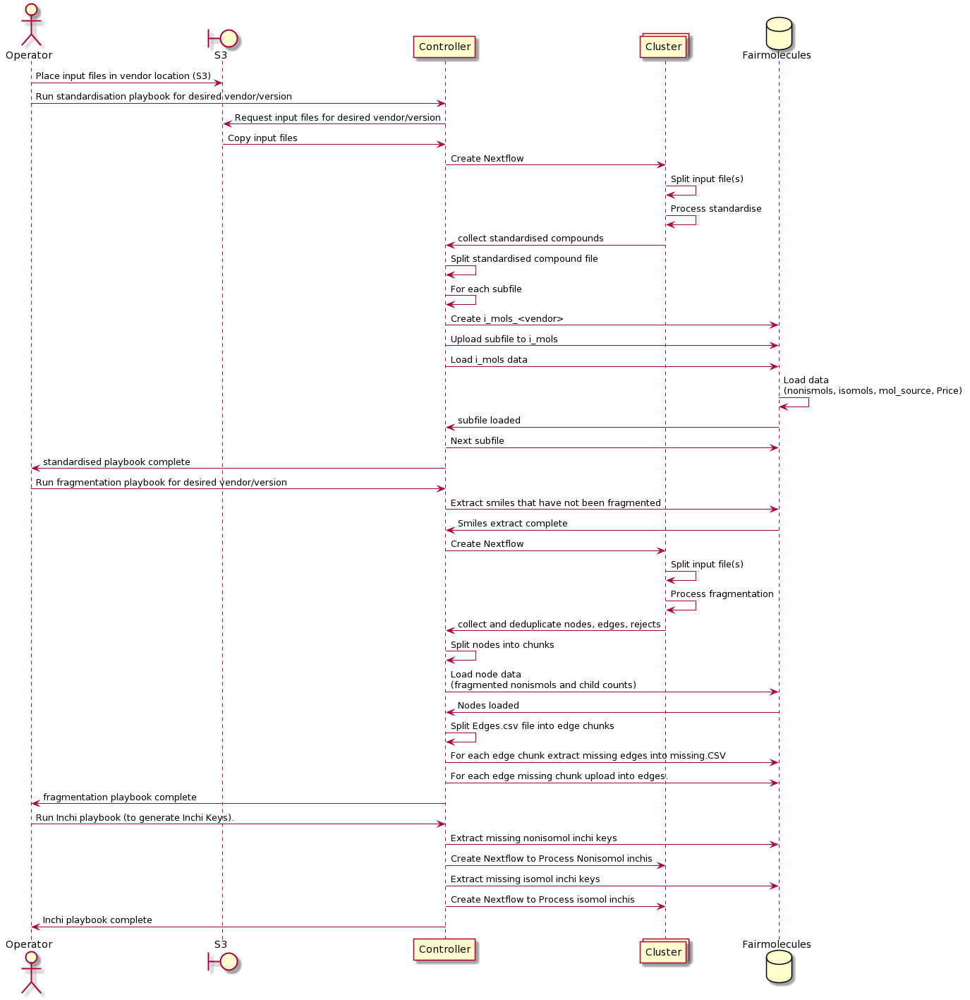

# Fragmentation Optimisation

[](https://travis-ci.com/InformaticsMatters/fragmentor)


Optimisation of fragmentation process through the use of a postgres database to store already fragmented data. This will allow delta changes to an existing database rather than having to completely re-fragment the input files - speeding up the loading of extracts to the Neo4j database.

Summary of Contents:

- Ansible playbooks to: create postgres database, standardisation, fragmentation and inchi creation to populate the database 
- A further playbook to extract datasets of single and combinations of vendors for import into the Fragnet Search Neo4j database.
- Standardise and fragmentation code based on the Fragalysis Repository 
- Nextflow scripts to control cluster for Standardisation and Fragmentation steps.
- Automatic parameter controlled chunking of input files at various stages to control throughput to the sql database.  
- Processing is automated but can be adjusted with control parameters.
- Processing starts/ends with an AWS S3 repository - assumed to contain the smiles data from vendors to be imported into the process and will be the destination for Neo4j compatible extract files - and where they can be picked up by Fragnet Search..  

## Prerequisites

Install requirements: -

    $ pip install -r ../requirements.txt
    $ ansible-galaxy install -r ../requirements.yaml
    
You will need to provide an `OS_USERNAME` (expected by host_vars)
in order to connect to the DB server configuration. You will also need to
ensure that the user's `~/.ssh/id_rsa` is set correctly so that Ansible can ssh
to the servers. If the following works you should be able to run the
project playbooks...

    $ ansible -m ping all

You will also need AWS credentials for S3 to set up the following parameters. 

```
export AWS_ACCESS_KEY_ID=<Access Key ID>
export AWS_SECRET_ACCESS_KEY=<Secret Access Key>
```

## Creating the Postgres Database

The database is created in a docker container. Configuring the production database server (a destructive action) is 
done via an ansible playbook. This playbook also pre-loads the `vendor_name` table in the Fairmolecules database with 
the vendor files types currently supported by the process. 

```
$ ansible-playbook site-configure.yaml  \ 
          -e deployment=<development|production>
```

Example: navigate to the ansible directory

    $ ansible-playbook site-configure.yaml -e deployment=production

>   You only really need to run the `site-configure` play once.
    It configures the server with Docker and runs the designated database
    image and then formats the initial DB.

Parameter deployment=development|production

This parameter tells the playbook to either set up a production instance (a database server) or to use a Postgres in 
a local docker container on, say, a laptop. The deployment is configured in the all.yaml file.


## Process Description

The sequence diagram below shows the basic steps in the new end-to-end fragmentation 
process including a fragmentation database called FairMolecules. The advantage of the database 
approach over the current process is that each time a new dataset of molecules is provided by 
the vendor, the relatively lightweight standardisation step must still be performed - but only 
new molecules will  have to go through the fragmentation step. As this is hardware intensive, 
large time/cost savings should be possible. 

- The process is run by an operator. The operator configures the process and place the input 
files in the correct location on AWS S3. 
- The Controller is the head node where the fragmentor repository is installed. All Ansible 
playbooks are run from the head node.
- The Cluster is a Cluster-group used by nextflow for the standardisation, fragmentation and 
inchi key generation steps. Ansible handles these machines.
- Fairmolecules is the postgres database containing standardisation and fragmentation data as
 well as indexes used by the extraction playbook. Extracted Neo4j datasets are uploaded from 
 here back to S3 to complete the process.   




## Configuring the AWS S3 Directory Structure

For a production deployemnt, the ansible playbook site-standardise is configured to import vendor data files from a tree 
structure defined as either:

    <raw><vendor><library><version>
or

    <raw><vendor><version>

Examples: 
- Data files for version: v1 of the dsip library for vendor xchem should be placed in directory:
```
 xchem/dsip/v1 
```
- Data files for version: 2020-02 for vendor Molport (only one library) should be placed in directory:
```
 molport/2020-02 
```

The ansible playbook site-extract is configured to export datasets to a tree structure defined as:

    <extract><vendor_library><version> for Neo4j extracts for individual vendor libraries
or 

    <combination><first vendor_library><date> for Neo4j extracts for combinations of vendor libraries 

Examples: 
- The Neo4j extract for version: v1 of the dsip library for vendor xchem is exported to directory:
```
xchem_dsip/v1 
```
- The Neo4j extract for version: 2020-02 for vendor Molport (only one library) is exported to directory:
```
molport/2020-02 
```
- The Neo4j extract for a combination of the above libraries run on 1/1/2020 (assuming xchem is listed first in the 
request) is exported to directory:
```
combination/xchem_dsip/2020-01-01 
```


## Process a Vendor Library

The process consists of three steps, described below:

### Standardisation

The standardisation step is run as follows:

```
$ ansible-playbook site-standardise.yaml  \ 
          -e vendor=<vendor_library> \ 
          -e version=<version> \
          -e deployment=<development|production>
          (-e add_file=<yes|no>)
          (-e clean_start=<yes|no>)
```

Example: navigate to the ansible directory

```
$ ansible-playbook site-standardise.yaml -e vendor=xchem_dsip -e version=v1 -e deployment=production  
```

> Parameter deployment=development|production

This parameter tells the playbook to use either:
 1. AWS S3 or the data directory in the repository (which contains small test files) as a source for input files.
 2. The production or development postgres database.

> Optional parameter add_file: default: no

The standardisation step will validate whether the library has been processed before and raise an error if this is the 
case. The optional add_file parameter allows an additonal (set of) files to be added to an existing library. Note that 
the standardisation step will process all files in the input location, so the add_file will work more efficiently if this
location only contains the required files for that run.  

> Optional parameter clean_start: default: yes

If set to 'No', it will not delete the contents of the previous run. This is provided only for debugging purposes and 
should be used with caution.


### Fragmentation

The fragmentation step will identify molcules for the vendor/library that have not been fragmented yet and process them.
It is run as follows:

```
$ ansible-playbook site-fragment.yaml  \ 
          -e vendor=<vendor_library> \ 
          -e version=<version> \
          -e deployment=<development|production>
```

Example: navigate to the ansible directory

```
$ ansible-playbook site-fragment.yaml -e vendor=xchem_dsip -e version=v1 -e deployment=production  
```

A fragmentation step would normally be processed directly after a standardisation step, but as this step is driven by 
the database it it possible to run multiple standardisation steps for a vendor/library followed by a single fragmentation
step.


### Create Inchi Keys

The Create Inchi step will identify any molcules that have not had inchi keys generated yet and process them.
It is not vendor/library specific and can be run as follows:

```
$ ansible-playbook site-inchi.yaml  \ 
          -e deployment=<development|production>
```

Example: navigate to the ansible directory

```
$ ansible-playbook site-inchi.yaml -e deployment=production  
```
As this step is driven by the database it it possible to run multiple standardisation/fragmentation steps for different 
vendor/libraries followed by a single create_inchi step.


## Extract a Neo4j Dataset to S3.

The Extract Neo4j Dataset step will create a dataset based on parameters provided in a parameter file containing 
vendor(s) and version(s) in the following example format:

```
extracts:
    - lib:
        vendor: 'enamine_ro5'
        version: 'jun2018'
        regenerate_index: 'no'
    - lib:
        vendor: 'molport'
        version: '2020-02'
        regenerate_index: 'yes'
```

The first time a library version is extracted, regenerate_index should be set to 'yes' so that the index of edges for 
the latest library version can be regenerated.  For subsequent runs (e.g. to extract combinations) it can be set to 'no'
for speed - for the larger vendors this can be a significant amount of time. 
A template (extract-parameters.template) is provided for this file.

The command is:

```
ansible-playbook site-extract \
     -e <@parameters> \
     -e deployment=<development|production> \
     (-e save_extract=<yes|no>)
```

Example: navigate to the ansible directory

```
$ ansible-playbook site-extract.yaml -e deployment=production  
```

> Optional parameter save_extract: default: yes

The save_extract flag indicates whether files should be zipped and uploaded to AWS S3. For 
deployment=development this would normally be set to "N".


## Backing up the Database

A simple backup play can be used to copy the database files to the
backup volume in the DB server. It stops the database, copies the files
and then restarts the database: -

Example: navigate to the ansible directory

```
ansible-playbook site-configure_stop-database.yaml -e deployment=production 
ansible-playbook site-backup.yaml -e deployment=production 
ansible-playbook site-configure_start-database.yaml -e deployment=production   
```

## Tuning Parameters

The file all.yaml contains the following parameters used to control the different steps of the process.  

> Hardware sizing - used to calculate size of chunks in standardization/fragmentation. A map of variables based on 
>deployment and should reflect the approximate CPUs available on the machine/cluster.


For example:
```
hardware:
  development:
    parallel_jobs: 8
  production:
    parallel_jobs: 160
```

> Vendor defaults.

A map of defaults based on the vendor and library. In general it should not be necessary to change these unless there is 
a significant change to the size/composition of vendor supplied libraries.

For example xchem_dsip is set up as follows.

```
vendors:
  xchem_dsip:
    # Used for sizing timeouts and processing parameters
    approx_vendor_molecules: 800
    # Total time (in minutes) across all CPUs - Used for sizing timeouts and processing parameters
    est_total_fragmentation_time: 10
    # Minimum heavy atom count for extraction/fragmentation processing
    fragminhac: 0
    # Maximum heavy atom count for extraction/fragmentation processing
    fraghac: 36
    # Maximum frag cycles for fragmentation processing
    fragmaxfrags: 12
    # Limit for partial fragmentation processing (not operational)
    fraglimit: 0
    # Extract Playbook: Chunk of molecules to be processed before insert to index
    # This is a sensitive value - settings for each vendor should be tuned.
    # So the values below are set based on the number of edges per mol_source value
    # and validated by testing.
    extractchunksize: 800
```

## Approximate Sizing and Timings

Numbers are given based on a maximum fragmentation cycles of 12. 

| Vendor/Lib   | Version     | Molecules   | Nodes       |Edges        |
| ------------ | ----------- | ----------- | ----------- | ----------- | 
| Xchem_dsip   | v1          | 768         | 5099        | 14221       |
| Molport      | 2020-01     | 7118865     | tba         | 582264651   |
| Chemspace_bb | December2019| 17257752    | tba         | 111716670   |
| Enamine_ro5  | Jun2018     | tba         | tba         | tba         |


## FairMolecules Database Schema

The diagram below shows the FairMolcules database schema: 


Tables beginning with “i_” (not shown) are used in the loading process and tables beginning with "o_" are used in the 
extract process. 

## Adding a new vendor library to the repository

TBA: a summery of changes to add a new vendor library.


## Running Python Scripts directly via the conda environment

Create the environment:
```
conda env create -f environment.yml
```

Activate the environment:
```
conda activate fragmentor
```

Removing the environment:
```
conda env remove --name fragmentor
```

## Future Improvements

TBA: a summary of major planned improvements.